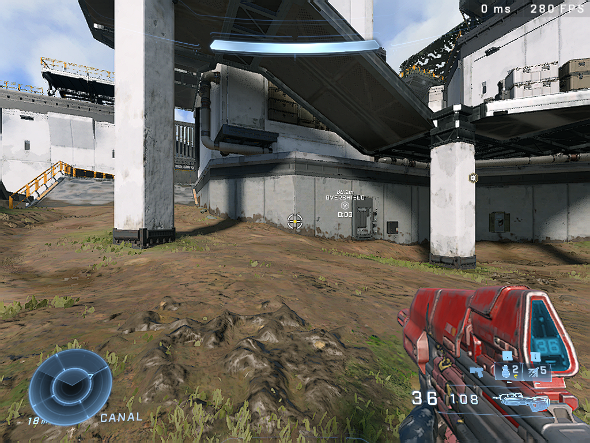

# Halo Infinite

<center>

</center>

## Information

This article with cover on how to optimize Halo Infinite.

Halo Infinite is both available on:<br>

- :simple-steam: Steam
- :simple-microsoft: Microsoft Store

Because of this some optimizations might be either specific to the Steam or Microsoft Store version of the game.

## Removal of High Resolution Texture Packs
!!! info "Supported Platforms"
    - [x] :simple-steam: Steam
    - [x] :simple-microsoft: Microsoft Store

The High Resolution Texture Packs ship with the game are know to cause stuttering & performance issues.

1. On the title screen, go to the Control Panel.
2. Select "Manage Game" from the Control Panel.
3. Make sure the only thing that is select is the Campaign, if you own it.
4. Finally hit <button>**[Apply]**</button> to apply the changes.


## Aggressive Dynamic Resolution Scaling

!!! info "Supported Platforms"
    - [x] :simple-steam: Steam
    - [x] Microsoft Store

!!! note
    You may refer to [Visual Quality Tweaks](#visual-quality-tweaks) to fix any quality issues caused by aggressive dynamic resolution scaling.

We may abuse the `Minimum Framerate` option for better performance.
By setting the value to `960` FPS, dynamic resolution scaling becomes insanely aggressive providing noticable performance gains.

1. Open the `SpecControlSettings.json` file depending on your platform:<br>

    |Platform|Filepath|
    |-|-|
    |Steam|`%LOCALAPPDATA%\HaloInfinite\Settings\SpecControlSettings.json`|
    |Microsoft Store|`%LOCALAPPDATA%\Packages\Microsoft.254428597CFE2_8wekyb3d8bbwe\LocalCache\Local\HaloInfinite\Settings\SpecControlSettings.json`|

2. Set the following key-value pair to the following:<br>
    ```js
    "spec_control_minimum_framerate": {
        "version": 2,
        "value": 960
    },
    "spec_control_target_framerate": {
        "version": 1,
        "value": 960
    } 
    ```

3. Here are the results for:<br>
    - 1920 x 1080
    - Low Settings (Including Settings that may be turned off.)

    !!! image "No Minimum Framerate"
        
    !!! image "Minimum Framerate"
        

## Visual Quality Tweaks

!!! info "Supported Platforms"
    - [x] :simple-steam: Steam
    - [x] :simple-microsoft: Microsoft Store

### :simple-nvidia: NVIDIA
If you are having an NVIDIA GPU, you may avail the following techonlogies to improve visual quality:<br>

!!! abstract "NVIDIA Image Sharpening"
    > Applies a sharpness filter to the target application to improve visual quality.
    To use image sharpening do the following:<br>

    1. Make sure NVIDIA Image Scaling is disabled for Halo Infinite.
    2. Open the Windows Registry Editor:<br>
        1. Go to the following key:<br>
            ```
            HKEY_LOCAL_MACHINE\SYSTEM\CurrentControlSet\Services\nvlddmkm\FTS
            ```
        2. Find a value called `EnableGR535` and set its value to `0`.<br>
            This will replace Image Scaling with Image Sharpening in the NVIDIA Control Panel.
    3. Open up the NVIDIA Control Panel, under Manage 3D Settings, Program Settings, select Halo Infinite.
    4. Configure the sharpness and film grain values for the game.

!!! abstract "NVIDIA Image Scaling"
    > This is a proper upscaling technology shipped by the NVIDIA Driver, suppose to be a successor to NVIDIA Image Sharpening.

    1. Open up the NVIDIA Control Panel, under Manage 3D Settings, Program Settings, select Halo Infinite.
    2. Enable NVIDIA Image Scaling and also **enable** the overlay indicator.
    3. Configure the sharpness values for the game.

!!! abstract "Negative LOD Bias"
    > This option improves texture quality and **not** image quality, lower the value, the more sharper.

    This requires [NVIDIA Profile Inspector](https://github.com/Orbmu2k/nvidiaProfileInspector/releases/latest) to be downloaded.

    **Make sure, Negative LOD Bias is enabled for Halo Infinite in the NVIDIA Control Panel!**

    1. Open NVIDIA Profile Inspector.
    2. Navigate to Halo Infinite and set the following to:

        |Setting|Value|
        |-|-|
        |Antialiasing - Transparency Supersampling|2x Sparse Grid Supersampling|
        |Texture Filtering - LOD Bias (DX)| Anywhere between `0` ~ `-3`|
    3. Save the profile.


### :custom-amd: AMD
One may leverage the following technologies to improve visual quality:<br>

- AMD Radeon™ Image Sharpening
- AMD Radeon™ Super Resolution

    > This feature requires the game to be running at a lower display resolution.

Each feature may be enabled globally or for the game specifically.

## Modifications
Modifications maybe used to either fix or improve certain technical aspects of the game.

### [ZetaLoader](https://github.com/Aetopia/Zetaloader)

!!! info "Supported Platforms"
    - [x] :simple-steam: Steam
    - [ ] :simple-microsoft: Microsoft Store

#### Features

An open source modification/patch for Halo Infinite that aims to fix and improve some aspects of the game which include:<br>

1. Borderless Fullscreen Fix:
    Fixes issues with the game's borderless fullscreen implementation not filling the screen correctly at certain resolutions.
2. Jittery Input Fix:
    Fixes jittery input when an external framerate limiter is used.
3. User Specified Display Mode Support:

    Allows Halo Infinite to run at any display mode that is supported by the primary monitor/display.

    !!! image "1024x768 with ZetaLoader along with Aggressive Dynamic Resolution Scaling."
        

    !!! image "1024x768 with Visual Quality Tweaks and ZetaLoader along with Aggressive Dynamic Resolution Scaling."
        

    !!! warning
        Availing this feature, results in the following in game options being broken:

        - Display Monitor 
        - V-Sync
        - Framerate Limiter

        In that case use driver based V-Sync and an external framerate limiter.

4. Multimedia Class Schedule Service Scheduling
    Make DWM opt in for MMCSS for a performance boost.
5. 0.5 ms Timer Resolution
    Improves `0.X` lows when the framerate is capped.

!!! tip
    For more information on the project, view ZetaLoader's GitHub repository.<br>
    **GitHub Repository: [https://github.com/Aetopia/Zetaloader](https://github.com/Aetopia/Zetaloader)**
#### Installation 
1. Download the latest version of ZetaLoader from [GitHub Releases](https://github.com/Aetopia/ZetaLoader/releases/latest).
2. Open Halo Infinite's installation directory.
3. To install ZetaLoader for the campaign and multiplayer, place the dynamic link library in the following folders:<br>

    !!! note 
        Since Halo Infinite's campaign and multiplayer are separated both required their own copy of ZetaLoader.
    - Multiplayer: `"<Installation Directory>\game"`
    - Campaign: `"<Installation Directory>\subgames\CampaignS1"`

#### Uninstallation
Simply remove `dpapi.dll` from Halo Infinite's Installation directory for the campaign and multiplayer.

#### Configuration
!!! warning
    You must restart the game for any configuration file changes to reflect.

To configure ZetaLoader, do the following:

1. Go to the following directory: `"%LOCALAPPDATA%\HaloInfinite\Settings"`.
2. Create a new file called `ZetaLoader.ini`, this is ZetaLoader's configuration file.
3. Add the following contents into the file:<br><br>
    ```ini
    [Settings]
    Fullscreen = 0 
    Width = 0
    Height = 0
    Frequency = 0
    ```

    |Key|Value|
    |-|-|
    |`Fullscreen`|Toggles ZetaLoader's Borderless Fullscreen.<br><ul><li>`0` - Disabled</li> <li>`1` - Enabled</li></ol>|
    |`Width`|Display Resolution Width when ZetaLoader's Borderless Fullscreen is enabled.|
    |`Height`|Display Resolution Height when ZetaLoader's Borderless Fullscreen is enabled.|
    |`Frequency`|Display Frequency when ZetaLoader's Borderless Fullscreen is enabled.|

Example:
```ini
[Settings]
Fullscreen = 1
Width = 1360
Height = 768
Frequency = 60
```
This will make Halo Infinite run `1360`x`768` @ `60` Hz with ZetaLoader's Borderless Fullscreen enabled.

### Special-K
!!! info "Supported Platforms"
    - [x] Steam
    - [x] Microsoft Store

Special K is an open source tool for fixing issues and enhancing games.
#### Installation
Depending on what platform, you are playing from, you may opt in for using the local or global installation option.

##### Local
!!! info "Supported Platforms"
    - [x] :simple-steam: Steam
    - [ ] :simple-microsoft: Microsoft Store
1. Download the latest from [here](https://github.com/SpecialKO/SpecialK/releases/latest).
2. Unzip the `.7z` archive file.
3. Rename `SpecialK64.dll` to `dxgi.dll`
4. Place it in Halo Infinite installation directory.

    !!! note 
        Since Halo Infinite's campaign and multiplayer are separated both required their own copy of Special K.

        - Multiplayer: `"<Installation Directory>\game"`
        - Campaign: `"<Installation Directory>\subgames\CampaignS1"`

##### Global
!!! info "Supported Platforms"
    - [x] :simple-steam: Steam
    - [x] :simple-microsoft: Microsoft Store

1. Download [SKIF](https://sk-data.special-k.info/SpecialK.exe").
2. Once installed launch Halo Infinite through SKIF and Special-K should load.

##### Features
Special-K provides a vast range of features but this article will be focusing on:<br>

- [NVIDIA Reflex](https://wiki.special-k.info/en/Advanced/Video#nvidia-reflex)

    Special-K allows any DX11/12 game to use NVIDIA Reflex, even if it doesn't support it.

- [Special-K's Framerate Limiter](https://wiki.special-k.info/en/Advanced/Video#frame-rate-limiter)

    Special-K ships with a high end framerate limiter which can be used to improve framepacing and timing consistency.

- [Latent Sync](https://wiki.special-k.info/en/Advanced/Video#latent-sync)

    This is basically Software Based VRR (or Software Based G-Sync/FreeSync/Adaptive Sync).
    This feature caps the game at a factor of your monitor refresh rate and provides a tear free experience once configured.


- [Display and Window Management](https://wiki.special-k.info/en/Advanced/Video)

    Special-K also provides Display and Window Management and unlike ZetaLoader, Special-K's options are more robust and configurable. 

    !!! note
        If you consider using Special-K to change the display mode when the game is running, the display mode will not be restored when the game is deactivated.<br>
        ZetaLoader implements at the cost losing the ability to run any secondary monitor.

