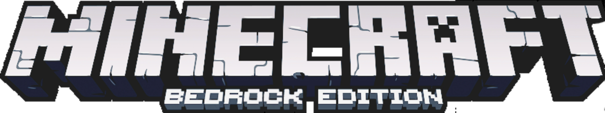

# 
**Note**: This guide is intended for Windows 10/11 users and is aimed at making Minecraft Bedrock Edition more playable by addressing various performance issues.

## :material-plus-thick: **General Tweaks**

Assuming you've already implemented other performance tweaks, these bedrock-specific modifications can further enhance your gaming experience.

### :octicons-arrow-switch-16: **Bedrock Edition Version Switcher**

Use this to manage and switch between different versions of Bedrock.

🔗 [Bedrock Edition Version Switcher](https://bedrocklauncher.github.io/)

### :material-toggle-switch-off: **Disable Vsync**

To disable Vsync, navigate to `%LOCALAPPDATA%\Packages\Microsoft.MinecraftUWP_8wekyb3d8bbwe\LocalState\games\com.mojang\minecraftpe\options.txt` and set `gfx_vsync` to **0**. You may also need to disable Vertical Sync in Nvidia Control Panel or AMD Adrenaline, as Vsync may still be active on some AMD graphics cards (a solution for this issue is currently unavailable).

### :material-cog: **Optimize In-Game Settings**

- **Fullscreen**: Turn this setting on, as windowed mode can introduce significant input lag.
- **Hide Paper Doll**: Enable this to hide the render of your character's skin in the corner of the screen, saving some performance.
- **Screen Animations**: Turn this off to remove animations when opening various GUI elements.
- **Screen Safe Area**: Adjust this to 100% for proper GUI sizing; decrease it if you prefer a smaller GUI.
- **View Bobbing**: Turn this off, as Bedrock's View Bobbing can be subpar.
- **Fancy Leaves**: You can turn this off for a slight boost in frames at the cost of visual quality.
- **Beautiful Skies**: Keep this on to enjoy custom skyboxes, as it has minimal impact on performance.
- **Smooth Lighting**: Leave this on unless you want to use fullbright to compensate for the visual downgrade.
- **Fancy Graphics**: Keep this on for improved entity appearances; turning it off makes entities look flat and 2D.
- **Dynamic FOV**: Depending on your preferred field of view (FOV), keep this on for visual feedback while sprinting.
- **GUI Scale**: Set this to -1, as going any larger can result in an unsightly appearance.
- **Render Distance**: Adjust based on your PC's performance: 16 for high-end, 12 for mid-range, and 8 for low-end machines. Very tiny render distances may not significantly improve performance and can sometimes make it worse.
- **Antialiasing**: Turn this off for a performance boost.

### :material-swap-horizontal-bold: **Alternative Versions of Bedrock**

!!! warning
    **After Microsoft stopped authenticating older versions of Minecraft: Bedrock Edition versions < 1.20 many servers like The Hive and Zeqa Have dropped support for these versions.**

- **1.18.12 x86**: This version utilizes the older engine and can provide significantly better performance compared to RenderDragon. Keep in mind that it may not be compatible with most mods/clients, and server support for this version may decrease over time.
- **1.12.1**: This older version offers the best performance and improved animations, but it lacks support from many servers. You can use an open-source proxy called Tedac to connect to modern PvP servers on version 1.12.

🔗 [Tedac Proxy](https://github.com/TedacMC/releases/releases) (*Use the Bedrock Edition Version Switcher provided*)

## **Enhancing Visuals**

### **Clean HUD Pack**

This pack adds a transparent Java Chat and a clear scoreboard without numbers to make the HUD cleaner and more aesthetically pleasing.

🔗 [Clean HUD Pack](https://mcpedl.com/clean-hud-pack/)

### **Java Animations by Ambient**

Bedrock's vanilla animations can leave much to be desired. Ambient's Java Animations pack brings familiar Java animations to Bedrock Edition, enhancing the overall experience.

🔗 [Java Animations](https://mcpedl.com/java-1-7-animations/)

### **Fog Remover Shader**

Non-RenderDragon Version: 🔗 [Fog Remover Shader (Non-RenderDragon)](https://www.mediafire.com/file/33ibsfwwehokkvy/) (Double-click the MCPack file to import.)

RenderDragon Version: 🔗 [Fog Remover Shader (RenderDragon)](https://www.mediafire.com/folder/jq2w100udi4t6)

### **Importing the shader into RenderDragon versions of the game**

* Open the games install directory using Bedrock Launcher

* Then from there, go into `Data/Renderer/materials` then place the binary files in there.

### Using DX11 with RenderDragon

Using DX11 Improves performance by upto 3x, to do this you need to add a [dll]() file in your game install directory

🔗 [d3d12.dll](https://raw.githubusercontent.com/couleur-tweak-tips/CTT/main/docs/resources/games/minecraft-bedrock/d3d12.dll)

**Credit**: The above was put together in the [CTT Discord](https://discord.gg/ctt) by Furzide.

