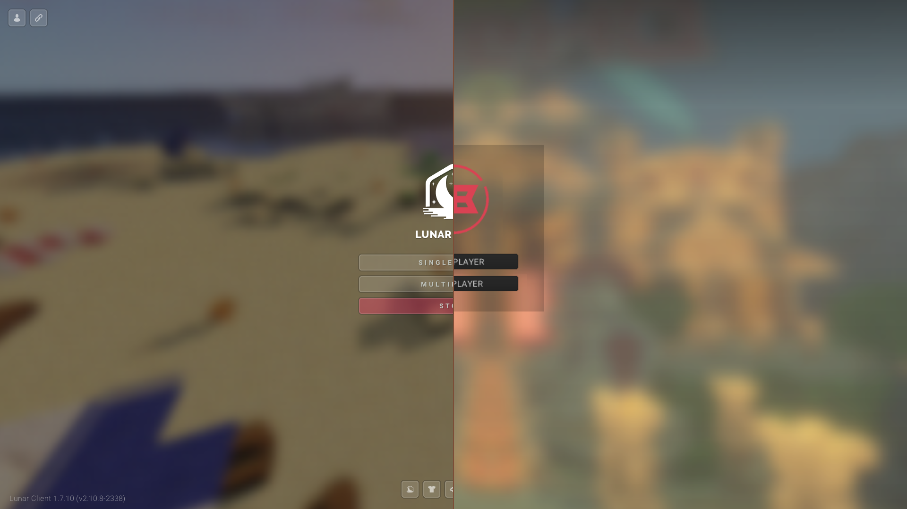

**Clients** - Optimising Minecraft is relatively simple; you should start by downloading a client. A reputable and widely known client for Minecraft is [*Lunar Client*](<https://www.lunarclient.com/download>). However, if you aim only to PVP and play on versions 1.8.9 and 1.7.10, then you could look into [*CheatBreaker*](<https://cheatbreaker.net/>), a client owned and maintained by one of the [*CTT*](https://discord.gg/ctt) managers, Tellinq.

After you’ve downloaded one of these clients, you should turn most, if not all, visual models off. You can keep the desirable ones like FPS, Toggle-Sprint, Saturation, etc.
### **Important Settings**:
**Fast Render**: This option should be enabled at all times as it gives a great increase to your fps and is the most impactful setting when it comes to performance, but this setting renders (pun intended) Shaders, Motion Blur, and Menu Blur unusable.

??? image "Fast Render Toggle"
    

**Custom Sky**: This option disables the custom sky added by some texture packs; depending on preference, you should have this off or on. With it off, you get a little fps boost.

**Render Distance**: For mini-games like Duels, you want your render distance ideally on 4, but anything between 3 and 8 is ideal.

    <video width="640" height="360" controls>
        <source id="mp4" src="../../assets/videos/games/minecraft-java/rd.mp4" type="video/mp4">
    </video>

**Resolution**: If you don’t have a computer that can handle high fps recording at a native resolution, you can try a [resolution](https://link.to.resolution.in.ctt.wiki) **lower** than your display's native resolution, as this can provide a huge FPS boost.

**Smooth FPS**: Enabling this setting will lower performance while lowering the GPU usage of Minecraft; this will lower [Encoding Lag](https://link.to.EncodingLag.in.ctt.wiki) by allowing [OBS](../video/obs/index.md) to use more resources.
