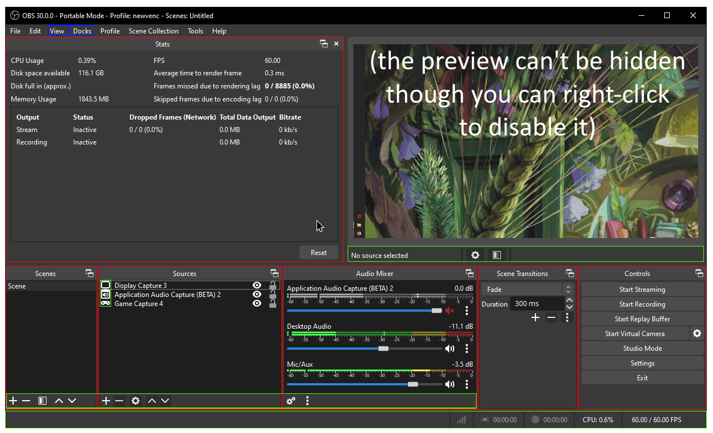

# :material-dock-window: Docks

OBS' user interface can be greatly customized depending on your use of it's Docks:

* in Blue: the <kbd>View</kbd> and <kbd>Docks</kbd> button mentioned throughout this article
* in Green: can be shown/hidden in <kbd>View</kbd>
* in Red: can be shown/hidden in <kbd>Docks</kbd>

## :material-chart-bar-stacked: Stats

Displays useful statistics regarding your recording and/or streaming status, most notably (see above):

* Memory Usage
* Total data output for recording & streaming
* Skipped/missed frames due to encoding/rendering lag
* Disk space available / Approximation of how long it'll take for the recording to fill up the disk

!!! important "There 2 are ways to view the stats dock"

    1. Enabling it in <kbd>Docks</kbd> lets you dock it into your interface (like previously shown)
    2. Enabling it in <kbd>View</kbd> stays a separate floating window

## :material-projector-screen-outline: Scenes

Scenes are collections of user-defined sources, to give you an idea they’re typically used by streamers who switch from game source w/ facecam, full-screen facecam, and starting stream soon / brb text.
<!--
Those arrow symbols just look wacky, decided to remove them.
-->

If you only make use of a single source at a time (e.g recording games) you could remove the Scenes Selector and Scene Transitions for some UI headroom. 

## Managing Docks

Simply select <kbd>Docks</kbd> or <kbd>View</kbd> -> Select/unselect which you want enabled.