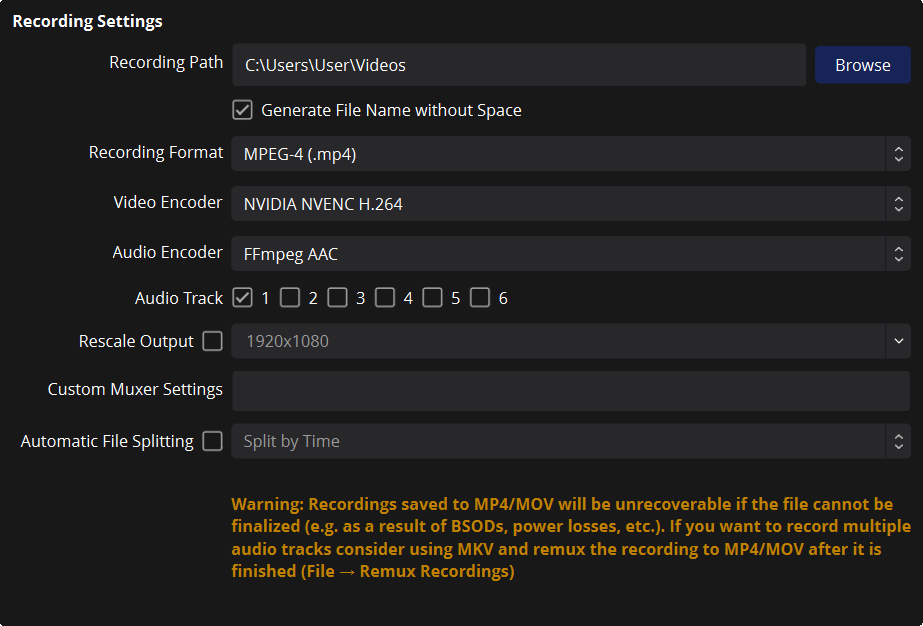
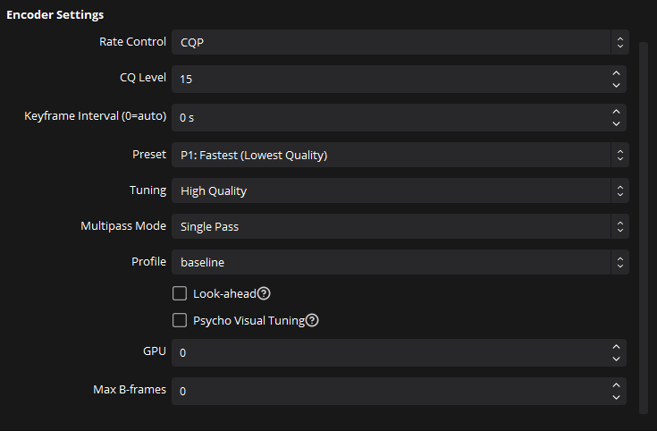

# :simple-nvidia: NVENC OBS Configuration

## :material-information-box: Information

??? warning "Support"
    NVENC only supports NVIDIA GPUs, with 10 series GPUs and above being ideal.
    
    Check which NVENC features your NVIDIA GPU supports on the [Video Encode and Decode GPU Support Matrix](https://developer.nvidia.com/video-encode-and-decode-gpu-support-matrix-new) page, which will tell you which codecs are supported and more.
    
    If your NVIDIA GPU doesn't support NVENC, try seeing if your iGPU has a hardware encoder or use [CPU x264](x264.md) as a last resort.

Before following this, make sure that you've followed the [initial configuration](index.md) first. **Make sure that you test your settings!** See [Replay Buffer](index.md#replay-buffer).

## :material-cog: Configuration

=== "Maximum Performance"
    :material-information-slab-circle: These settings maximize recording performance at high FPS.

    ??? image "Recording Settings"
        

            { width="600" }
        

    ??? image "Encoder Settings"
        

            { width="600" }
        

    <h3>Recording Settings</h3>

    - **Video Encoder:** Use **NVIDIA NVENC H.264**. (5)  

    <h3>Encoder Settings</h3>

    - **Rate Control:** CQP (6)

    - **CQ Level:** Use **15-18**, with higher being lower quality and lower being better quality. (7)

    - **Keyframe Interval:** Leave at **0 (auto)** for best performance.

    - **Preset:** Use **P1: Fastest (Lowest Quality)** for highest FPS. (9)

    - **Tuning:** Leave on **High Quality**.

    - **Profile:** Use **baseline**. (8)

    - **Look Ahead & Psycho Visual Tuning:** Leave **Off** for max performance. 

    - **GPU & Max B-Frames:** Leave GPU at 0 if single GPU. Leave B-Frames at 0.

=== "Best Filesize"
    :material-information-slab-circle: These settings optimize for smallest files without quality loss.
    
    <h3>Recording Settings</h3>

    - **Video Encoder:** Use **NVIDIA NVENC HEVC** (or **AV1** if you have a 40 series GPU).
        - If you want the best compatibility (including embeds on Discord), use **NVIDIA NVENC H264** at the cost of extra file size.

    <h3>Encoder Settings</h3>

    - **Rate Control:** CQP (3)

    - **CQ Level:** Use **18-23**, with higher being lower quality and lower being better quality. (4)

    - **Preset:** Use **P7: Slowest (Best Quality)**. (1)

    - **Profile:** Use **high**. (2)

<!-- some things are duplicated as seemingly you can't use an annoation twice -->

1. **:material-account-question: Why this preset?**  
Despite the name it doesn't affect your video quality. Our testing showed that "P1: Fastest (Lowest Quality)" results in the least encoding lag, but produces a bigger filesize. While "P7: Slowest (Best Quality)" significantly reduces the FPS you can record at, but results in a smaller filesize.

2. **:material-account-question: Why this profile?**  
Using "high" profile on newer GPUs may limit the fps you can record at, but it effectively reduces the file size. This won't affect your video quality.

3. **:material-account-question: Why CQP over CBR and VBR?**  
It adjusts the bitrate for **each individual frame**, resulting in better video quality. Compared to CBR which uses a fixed bitrate, and VBR which varies the bitrate based on the complexity of the video, CQP can provide more efficient file size management.

4. **:material-account-question: Why these particular values?**  
The CQ Level ranges from **1** (lossless, resulting in huge files) to **30** (very lossy, resulting in small files).  

    !!! example ""
        <h4>[:material-arrow-right: Click here to see the Quality vs CQP Level Graph](../../assets/images/video/obs/nvenc/quality_vs_cqp.png)</h4>

5. **:material-account-question: Why should you use H.264?**  
HEVC is more efficient but harder to encode, leading to worse performance. The same applies to AV1 on the RTX 40 series GPUs.

6. **:material-account-question: Why CQP over CBR and VBR?**  
It adjusts the bitrate for **each individual frame**, resulting in better video quality. Compared to CBR which uses a fixed bitrate, and VBR which varies the bitrate based on the complexity of the video, CQP can provide more efficient file size management.

7. **:material-account-question: Why these particular values?**  
The CQ Level ranges from **1** (lossless, resulting in huge files) to **30** (very lossy, resulting in small files).  

    !!! example ""
        <h4>[:material-arrow-right: Click here to see the Quality vs CQP Level Graph](../../assets/images/video/obs/nvenc/quality_vs_cqp.png)</h4>

8. **:material-account-question: Why this profile?**  
On newer GPUs, "baseline" may reduce encoding lag when recording at high FPS at the cost of the bigger file size. This won't affect your video quality.

9. **:material-account-question: Why this preset?**  
Despite the name it doesn't affect your video quality. Our testing showed that "P1: Fastest (Lowest Quality)" results in the least encoding lag, but produces a bigger filesize. While "P7: Slowest (Best Quality)" significantly reduces the FPS you can record at, but results in a smaller filesize.
