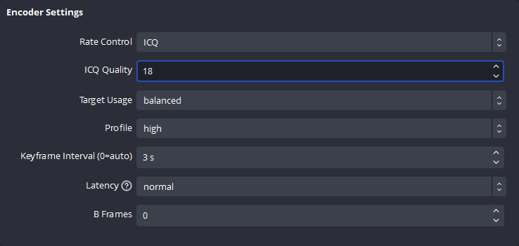

# :simple-intel: QuickSync OBS Configuration

Before following this, make sure that you've followed the [initial configuration](index.md) first. **Make sure that you test your settings!** See [Replay Buffer](index.md#replay-buffer).

## :material-cog: Configuration
:material-information-slab-circle: These settings are intended for recording Minecraft at 30-60 frames per second with acceptable quality and medium file sizes. If you're looking to record with high fps, look to [other encoders](#index.md#where-to-go-from-here) as an alternative to QuickSync

=== ":material-speedometer: Maximum Performance"

    ??? image "Recording Settings"
        

            { width="600" }
        

    ??? image "Encoder Settings"
        

            { width="600" }
        

    <h3>Recording Settings</h3>

    - **Video Encoder:** Select the **Quicksync H.264** option. If you have an 11th gen or newer Intel CPU, you can select the **Quicksync HEVC** option instead.

    <h3>Encoder Settings</h3>

    - **Target Usage** Set to balanced, as quality slows down the encoding process with no visible quality difference. However performance has a noticeable impact on quality, and no performance gains. So it's best to leave it at balanced. 

    - **Profile** Keep at high or baseline, as there is no measurable performance difference or quality difference. 

    - **Keyframe Interval** Leave to 0 (auto) or 3 for the best performance and quality. 

    - **Rate Control** Opposed to using CQP(6), It's preferable to use ICQ for best efficiency, as it will adapt the bitrate per frame.

    - **ICQ Quality** Forget about size in bytes, quality ranges from 1 (practically lossless, huge file), to 30 (very lossy, small), the higher you go, the smaller the file. From testing, 15-18 is a good range for quality and filesize. However QSV will not reach the visual acuity of NVENC no matter how low you go, so it's best to save on performance and opt for higher numbers like 20-25 to ensure good performance while playing and recording. 

    - **Latency** Set this to normal, as you aren't streaming. This setting is useful for getting the delay as low as possible during live streams but since this is a recording, you will not be needing it to be set lower than normal.

    - **Max-B-frames** Leave Max-B-frames to 0 for recording minecraft, however if you wish to play games with slower on screen movement, set it to 3.

    > The following settings have been tested by `@ashanki` on Minecraft Bedrock Edition versions (1.16.100-1.20.12) & Minecraft Java Edition versions (1.7.10-1.20.1). If you have any questions or data to add to this (10), please contact `@ashanki` in the [CTT Discord](https://discord.gg/ctt).

<!-- some things are duplicated as seemingly you can't use an annotation twice -->

1. **:material-account-question: Why this preset?**  
Despite the name it doesn't affect your video quality. Our testing showed that "P1: Fastest (Lowest Quality)" results in the least encoding lag, but produces a bigger filesize. While "P7: Slowest (Best Quality)" significantly reduces the FPS you can record at, but results in a smaller filesize.

2. **:material-account-question: Why this profile?**  
Using "high" profile on newer GPUs may limit the fps you can record at, but it effectively reduces the file size. This won't affect your video quality.

3. **:material-account-question: Why CQP over CBR and VBR?**  
It adjusts the bitrate for **each individual frame**, resulting in better video quality. Compared to CBR which uses a fixed bitrate, and VBR which varies the bitrate based on the complexity of the video, CQP can provide more efficient file size management.

4. **:material-account-question: Why these particular values?**  
The CQ Level ranges from **1** (lossless, resulting in huge files) to **30** (very lossy, resulting in small files).  

    !!! example ""
        <h4>[:material-arrow-right: Click here to see the Quality vs CQP Level Graph](../../assets/images/video/obs/nvenc/quality_vs_cqp.png)</h4>

5. **:material-account-question: Why should you use H.264?**  
HEVC is more efficient but harder to encode, leading to worse performance. The same applies to AV1 on the RTX 40 series GPUs.

6. **:material-account-question: Why CQP over CBR and VBR?**  
It adjusts the bitrate for **each individual frame**, resulting in better video quality. Compared to CBR which uses a fixed bitrate, and VBR which varies the bitrate based on the complexity of the video, CQP can provide more efficient file size management.

7. **:material-account-question: Why these particular values?**  
The CQ Level ranges from **1** (lossless, resulting in huge files) to **30** (very lossy, resulting in small files).  

    !!! example ""
        <h4>[:material-arrow-right: Click here to see the Quality vs CQP Level Graph](../../assets/images/video/obs/nvenc/quality_vs_cqp.png)</h4>

8. **:material-account-question: Why this profile?**  
On newer GPUs, "baseline" may reduce encoding lag when recording at high FPS at the cost of the bigger file size. This won't affect your video quality.

9. **:material-account-question: Why this preset?**  
Despite the name it doesn't affect your video quality. Our testing showed that "P1: Fastest (Lowest Quality)" results in the least encoding lag, but produces a bigger filesize. While "P7: Slowest (Best Quality)" significantly reduces the FPS you can record at, but results in a smaller filesize.

10. ** Request for data!**
If you have an Intel 11th gen or newer CPU, please contact `@ashanki` on the [CTT Discord](https://discord.gg/ctt) to help us gather data on the performance of Quicksync HEVC, as it remains largely untested.