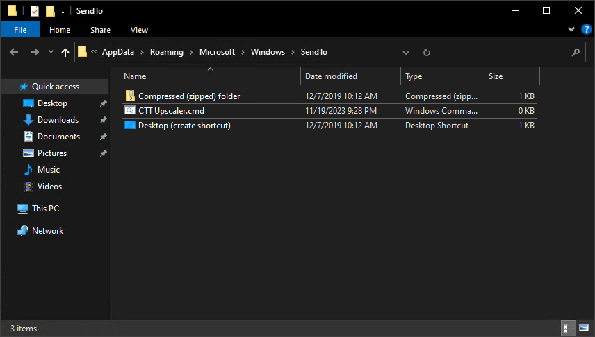

# :fontawesome-regular-share-from-square: Send To

Send To is a feature in Windows' right-click (context) menu that can launch scripts with the file(s) you selected

{ width="600" }


# Opening the Send To folder

It can be opened by typing `shell:sendto` in the run dialog (Win+R)

{ width="450" }

Here you can make and remove shortcuts to scripts and folders


{ width="450" }

## Script arguments behavior

!!! Info
    *Executable* means be any of the following:
    
    * A shortcut to an executable or batch file
    * An executable or batchfile, literally

Dragging file(s) on an executable, and doing Send To -> that executable has the same behavior: 

That executable gets launched with each argument being the full file path of the file(s) selected

```
example.cmd "D:\vids\clip1.mp4" "D:\vids\clip2.mp4"
```

## Program compabitility

The following programs support passing multiple file paths at once :white_check_mark::

* [Smoothie](./smoothie/index.md): i've natively made it support this 
* LosslessCut: in a "batch mode"

These programs only support opening with one video at a time :x:

* Avidemux: It can only open one video file at once
* [FFmpeg](./ffmpeg/index.md): Each input media file needs to be separated with `-i`


## Folder behavior

You can also place shortcuts to folders if you want to be able to copy / move files to specific places from anywhere in the Explorer:

* Simply left clicking will <u>copy</u> the file
* <kbd>SHIFT</kbd> clicking it will <u>move</u> the file