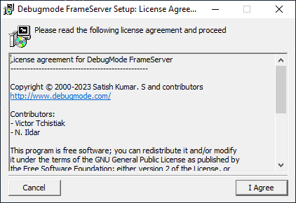
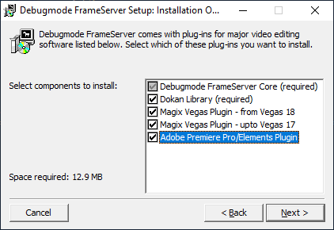
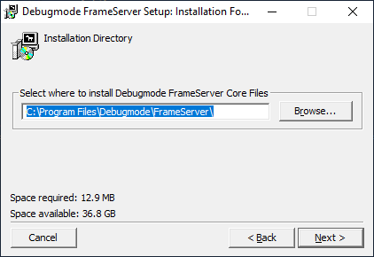
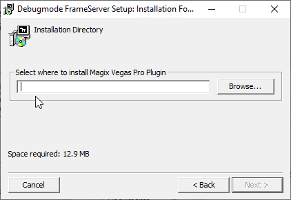
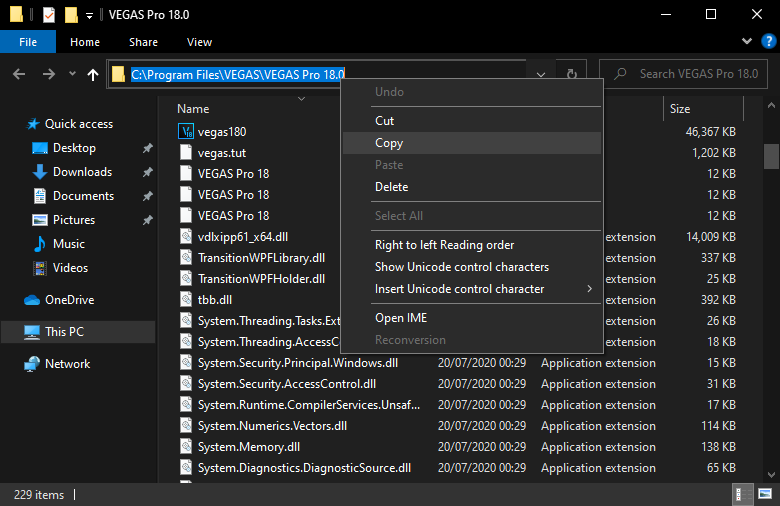
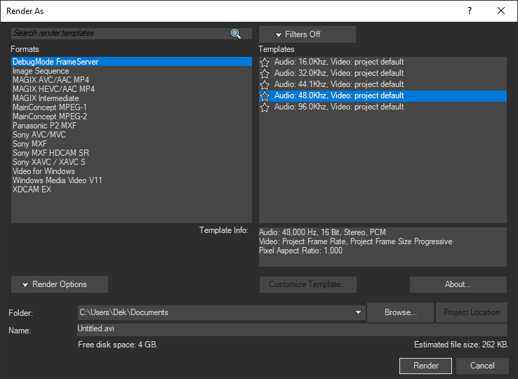
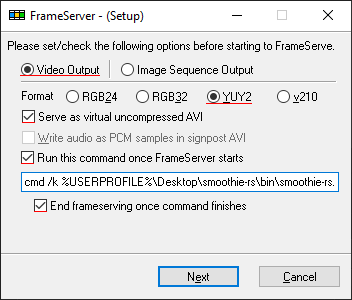

# Exporting from an NLE to Smoothie


!!! warning "Not suitable for most people"

    Because of bottlenecks I've yet to discover this

    also I forgot if I shipped Smoothie with AviSource, place [this DLL](https://github.com/vapoursynth/vs-avisource-obsolete/releases/tag/R1) in /bin/vapoursynth64/plugins/

DebugMode FrameServer lets your video editor export projects as a virtual uncompressed AVI file which Blur and Smoothie can use as input, effectively exporting indirectly to it.

It supports most VEGAS versions and Premiere Pro.

:material-plus: This comes with the niche convenience of not having to pre-render the clips you import

:material-minus: It can be excruciatingly slow to render with it

## Download

Grab it at the [DebugMode Homepage](https://www.debugmode.com/frameserver.html)

# Installation

### 1. Accept the [license](https://www.gnu.org/licenses/gpl-3.0.html)


### 2. Select the video editors you have



### 3. Indicate the <u>DebugMode FrameServer</u> installation directory, the default is fine:



!!! warning "Read the following steps carefully"
    Spamming "next" will install the plugins in the wrong directories, you NEED to manually copy your video editor's installation folder path.

### 4. Indicate the <u>VEGAS Pro</u> installation directory; find it this way:




Search VEGAS up in your search menu and right click it -> `Open file location`


You'll most likely end up in your start menu's program shortcuts, in that case right click the selected shortcut again and click `Open file location` again

If it opens a folder containing `vegasXX0.exe`, copy the folder path(1) and paste this
{ .annotate }

1. If not come ask for support on [Discord](https://discord.gg/CTT)



### 5. Indicate the <u>Adobe Premiere Pro</u> installation directory:

Do the same aforementioned instructions but with Premiere Pro

### 6. Install Dokan

It'll install the Dokan library which it uses to make virtual files,  <u>you do not need to install</u> the optional development plugins.


### 7. Choosing a render template

In VEGAS you'll have to choose an audio bitrate



VEGAS defaults to 48kHz (<kbd>CTRL+ENTER</kbd> to open Project Settings  -> Audio tab)

### 8. Configuring Debugmode Frameserver

You'll need to build up a command, here's what you need to know to assemble it

Start it with `cmd /k ` if you want it to stay open after Smoothie finishes running (e.g to see the crash message before it crashes)

Paste in the path of smoothie-rs.exe, get it by going in Smoothie's `/bin/` folder and <kbd>SHIFT+RIGHT CLICK</kbd>ing `smoothie-rs.exe` and clicking `Copy as path`

If the terminal closes before you can see an error if one occurs, or if you're doing it for the first time, consider adding the following at the start of your command:
```
cmd /k
```

You'll need to go in Smoothie's `/bin/` folder and shift-right click `smoothie-rs.exe` -> Copy as path and paste it in

For Blur you should be able to find `blur-cli.exe` (or if you got older versions just `blur.exe`) `C:\Program files (x86)\blur`


You'll need to add the following arguments after:

```
-i "%~1"
```

You should find the output files in `C:\CCFS\virtual`, consider making a shortcut to it on your desktop/start menu





Here's some examples:

```
cmd /k "D:\smrs\bin\smoothie-rs.exe" -i "%~1"
```
```
"C:\Program Files (x86)\blur\blur-cli.exe" -i "%~1"
```