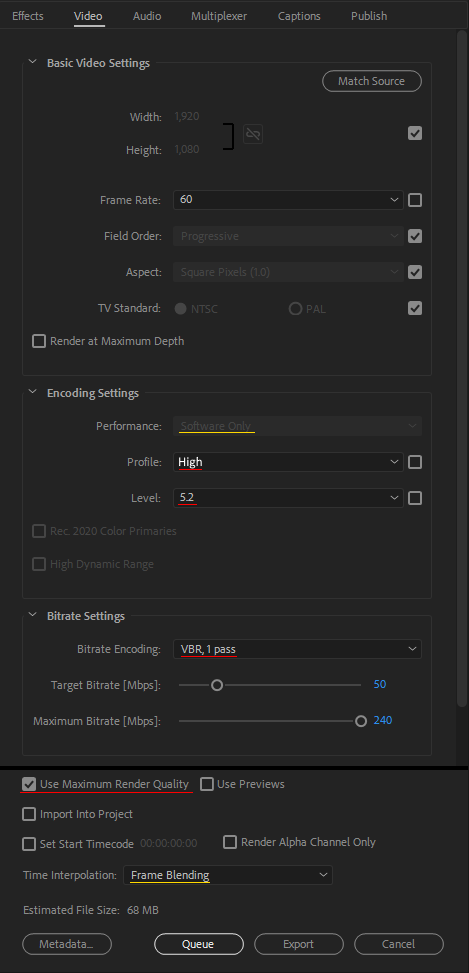
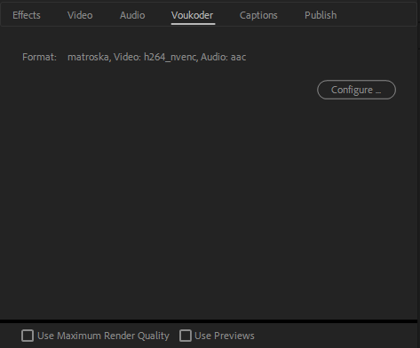
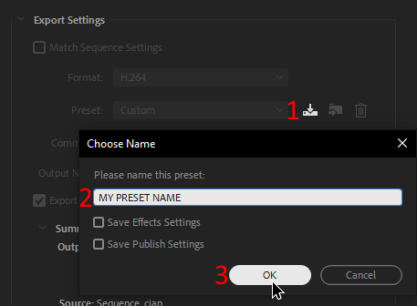

# Premiere Pro

Start by opening up your Export settings by going into `File` -> `Export` -> `Media...`

=== ":package: H264|H265"

    You may make your mind and choose between H.264 and H.265 in the [Codec guide](../codecguide.md)

    In `Encoding Settings` -> `Performance` if you have another option than `Software Only`, you're able to export using hardware accelerated encoding, see the link above

    

=== ":custom-voukoder: Exporting with Voukoder"

    After selecting Voukoder in the format drop down, configure the encoder by going into the Voukoder tab and clicking [`Configure...`](./configuration.md)

    

At the bottom `Time Interpolation` is a very important setting:

* `Frame Sampling`: Excess of framerate of your footage in comparison to the output Frame Rate will be dropped
* `Frame Blending`: Excess of framerate of your footage in comparison to the output Frame Rate will be blended together, giving it a motion blur effect, it's very common for people to agree that Premiere Pro's is the fastest but worst looking, consider pre-rendering with [Smoothie](../smoothie/index.md)

Don't forget to save your preset for later use

This will save as a `.epr` file in `%USERPROFILE%\Documents\Adobe\Adobe Media Encoder\12.0\Presets`